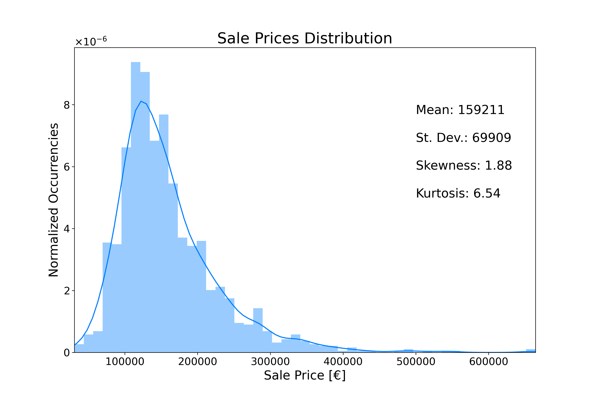

# House Prices Project (work in progress...)

## Data

The data (found on Kaggle: https://www.kaggle.com/c/house-prices-advanced-regression-techniques) has 81 explanatory variables describing (almost) every aspect of residential homes in Ames, Iowa. 

It is divided into two different datasets: 'train' and 'test'. The first one contain the feature 'SalePrice', while the second one does not.

Data can be found in the 'data' folder, along with a txt file explaining the meaning of each feature.

## Goal

The final goal is to predict the sale price for each house in the test dataset using a model trained using the train dataset.

## EDA Notebook
[house_pricing_EDA_notebook](https://github.com/niklai99/House-Pricing/blob/master/house_pricing_EDA_notebook.ipynb)

### Quick tracking of what can be found in the EDA notebook

 - Sale prices distribution

 - Scatter plots and strip plots of some correlated variables:

     - Price sales vs Living Area

     - Sale Prices vs Basement Area

     - Sale Prices vs Overall Quality

     - Sale Prices vs Year of Builing

 - Correlation Matrix 

 - Scatter plots of the most correlated variables with sale prices
 
 - Deleting missing data
 
 - Trating outliers
 
 - Testing normality
 
 - Testing homoscedasticity
 
 ### EDA notebook summary 
 
As every data analysis work begin, data has been read from the 'train' csv file. A brief look at the shape of the dataset shows that we have 1460 observations of 81 different features. 
 
Next, we've looked at the 'SalePrice' distribution, finding out that the distribution is positively skewed, has a quite sharp peak and deviate appreciably from the normal distribution. Also, the peak is located between 100'000 and 200'000 euros: most houses seems to be in this range of sale.

Then, among all the features available, we've selected a few that we thought are the most correlated with 'SalePrice': those are
 - Living Area
 - Basement Area
 - Overall Quality
 - Year of Builing
 
Our first guess was quite right: all of these variables appear to be positively correlated with the sale price. 

After that, we went more deep into in the correlation topic by approaching a correlation matrix: the most correlated features seems to be 'twin', as they actually deliver the same information. 

Exploring the most correlated variables with 'SalePrice', we've found that all the features previously analysed find a spot in the top 10! 

The most correlated variables with 'SalePrice' are:

   1. OverallQual 

   2. GrLivArea

   3. GarageCars

   4. GarageArea

   5. TotalBsmtSF

   6. 1stFlrSF

   7. FullBath

   8. TotRmsAbvGrd

   9. YearBuilt
   
We have then performed scatter plots between these variables and 'SalePrice', finding out that 'twin' features actually produce a very similar scatter pattern.

Leaving behind the correlations, we focused on the missing data: there are some features (luckily not the relevant ones) that lack a lot of observations. We proceeded by removing those features completely, as they are not relevant for the analysis we tried to pull out.

After that, we treated outliers and tested normality: since most of the distributions are positively skewed, a log trasformation worked perfectly to achieve satisfactory normality of the data.

Finally homoscedasticity has been also tested: it came out that log transformation worked quite well also for homoscedasticity! It has to be said though that results were not that remarkable as they were for normality.

## EDA Code
[house_pricing_EDA_code](https://github.com/niklai99/House-Pricing/blob/master/house_pricing_EDA_code.py)

